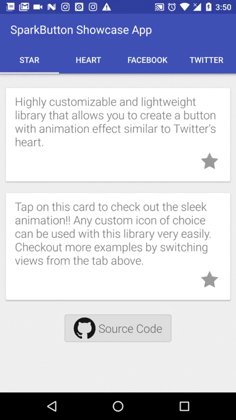

<!--
  Title: Spark Button
  Description: Highly customizable and lightweight library that allows you to create a button with animation effect similar to Twitter's heart animation.
  Author: varunest
  -->
[](https://www.android.com)
[](https://android-arsenal.com/api?level=14)
[](https://www.apache.org/licenses/LICENSE-2.0.html)
[](https://jitpack.io/#varunest/sparkbutton)
[](http://android-arsenal.com/details/1/3876)

#SparkButton
Highly customizable and lightweight library that allows you to create a button with animation effect similar to Twitter's heart animation.

Library supports OS on API 14 and above.



Grab the above demo app from here :

[](https://play.google.com/store/apps/details?id=com.varunest.sample.sparkbutton)

##Dependency

Add it in your root build.gradle at the end of repositories:

```
allprojects {
	repositories {
		...
		maven { url "https://jitpack.io" }
	}
}
```	
and then add dependency

```
dependencies {
	compile 'com.github.varunest:sparkbutton:1.0.0'
}
```

##Usage

###XML

```
<com.varunest.sparkbutton.SparkButton
            android:id="@+id/spark_button"
            android:layout_width="40dp"
            android:layout_height="40dp"
            app:sparkbutton_activeImage="@drawable/active_image"
            app:sparkbutton_inActiveImage="@drawable/inactive_image"
            app:sparkbutton_iconSize="40dp"
            app:sparkbutton_primaryColor="@color/primary_color"
            app:sparkbutton_secondaryColor="@color/secondary_color" />
```

###Java

```java
SparkButton button  = new SparkButtonBuilder(context)
                .setActiveImage(R.drawable.active_image)
                .setInActiveImage(R.drawable.inactive_image)
                .setDisabledImage(R.drawable.disabled_image)
                .setImageSizePx(getResources().getDimensionPixelOffset(R.dimen.button_size))
                .setPrimaryColor(ContextCompat.getColor(context, R.color.primary_color))
                .setSecondaryColor(ContextCompat.getColor(context, R.color.secondary_color))
                .build();
```

###Attributes

```
<attr name="sparkbutton_iconSize" format="dimension|reference" />
<attr name="sparkbutton_activeImage" format="reference" />
<attr name="sparkbutton_disabledImage" format="reference" />
<attr name="sparkbutton_primaryColor" format="reference" />
<attr name="sparkbutton_secondaryColor" format="reference" />
<attr name="sparkbutton_pressOnTouch" format="boolean" />
<attr name="sparkbutton_animationSpeed" format="float" />
```

##Documentation
To use SparkButton simply include XML script or build it using SparkButtonBuilder as stated above.

Various attributes that you can control are following: 

###Button Image and Colors
You can specify both active and inactive image of the button. If only active image is specified SparkButton will behave as a normal button, otherwise as a switch.

SparkButton takes two colors primary and secondary. (It is recommended that primary color is lighter than secondary for better results).

####XML
```
app:sparkbutton_activeImage="@drawable/active_image"
app:sparkbutton_inActiveImage="@drawable/inactive_image"
app:sparkbutton_primaryColor="@color/primaryColor"
app:sparkbutton_secondaryColor="@color/secondaryColor"
```
####Java
```
SparkButton button = new SparkButtonBuilder(context)
						.setActiveImage(R.drawable.active_image)
						.setInActiveImage(R.drawable.inactive_image)
						.setPrimaryColor(ContextCompat.getColor(context, R.color.primary_color))
						.setSecondaryColor(ContextCompat.getColor(context, R.color.secondary_color))
						.build();
```

###Animation Speed
You can specify the fraction by which the animation speed should increase/decrease.

####XML
```
app:sparkbutton_animationSpeed="1.5"
```

####Java
```
sparkbutton.setAnimationSpeed(1.5f);
```

###Button State
If you are using the SparkButton as a switch, you can 
check/uncheck the button

```java
sparkButton.setChecked(true);
```

###Event Listener

Simply call setEventListener to listen click events. 

```
sparkButton.setEventListener(new SparkEventListener(){
		@Override
		void onEvent(ImageView button, boolean buttonState) {
			if (buttonState) {
				// Button is active
			} else {
				// Button is inactive
			}
		}
});
```

###Play Animation
If you want to play animation regardless of click event execute following function:

```
sparkButton.playAnimation();
```

##Advanced
* 	There can be a situation when you don't want the button to 	scale download when pressed or consume touch. You can 	avoid this by calling the following function :

	```java
	sparkButton.pressOnTouch(false);
	```

* 	If you are using SparkButton between layout hierarchy, it 	can result in **animation getting cropped**. To avoid this 	cropping of the animation, set `clipChildren` and 	`clipToPadding` XML attribute of all the parent views 
	to `false`.

* 	You can view examples of few custom buttons in the [sample 	app](app).

##Inspiration
SparkButton was inspired by : [https://github.com/frogermcs/LikeAnimation](https://github.com/frogermcs/LikeAnimation)

##Contribution
Any contributions, large or small,features, bug fixes are welcomed and appreciated. Use pull requests, they will be thoroughly reviewed and discussed.

##License
Library falls under [Apache 2.0] (LICENSE.md)
